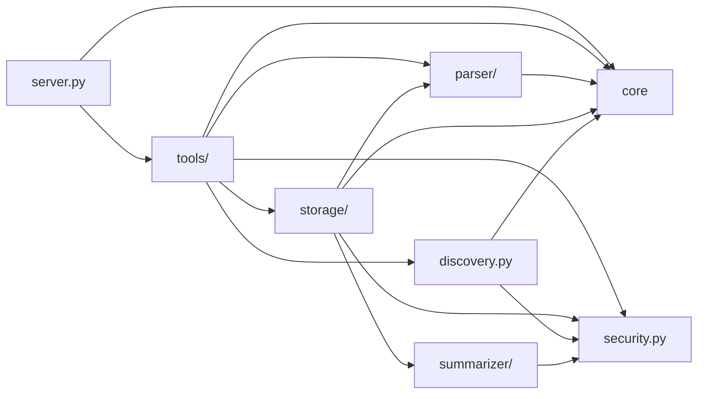

# Architecture — codesight-mcp

> Generated: 2026-03-09 | Scan Level: Exhaustive | Project Type: Python Library (MCP Server)

## Executive Summary

codesight-mcp is a security-hardened MCP server that indexes codebases via tree-sitter AST parsing and exposes 28 tools for symbol retrieval, code graph traversal, complexity analysis, and impact assessment. It follows a **layered library architecture** with a declarative tool registry, defense-in-depth security, and gzip-compressed persistent indexes.

The architecture prioritizes:
- **Security first** — 6-step path validation, content boundary markers, error sanitization, rate limiting
- **Extensibility** — Declarative `ToolSpec` and `LanguageSpec` registries for adding tools and languages
- **Token efficiency** — Byte-offset symbol extraction delivers ~99% token savings vs. full file retrieval
- **Reliability** — Atomic writes, advisory file locks, incremental index updates

## Architecture Pattern

**Layered library** with 5 clear layers and a thin server dispatcher:

```
┌─────────────────────────────────────────────────────────┐
│  MCP Protocol Layer (server.py — 593 lines)             │
│  Dispatcher: sanitize args → rate limit → route → wrap  │
└────────────────────────┬────────────────────────────────┘
                         │ ToolSpec registry
┌────────────────────────▼────────────────────────────────┐
│  Tool Layer (tools/ — 28 modules)                       │
│  Each tool: validate → resolve repo → query → format    │
│  Categories: Indexing | Navigation | Search | Graph |   │
│              Analysis | Dependencies & Diffing          │
└────┬──────────┬──────────┬──────────┬──────────────────┘
     │          │          │          │
┌────▼───┐ ┌───▼────┐ ┌───▼────┐ ┌───▼──────────┐
│ Parser │ │Storage │ │Summa-  │ │ Discovery    │
│ Layer  │ │ Layer  │ │rizer   │ │              │
│        │ │        │ │ Layer  │ │              │
└────────┘ └────────┘ └────────┘ └──────────────┘
     │          │          │          │
┌────▼──────────▼──────────▼──────────▼──────────────────┐
│  Core Layer (core/ + security.py)                       │
│  validation, boundaries, errors, limits, locking, rates │
└─────────────────────────────────────────────────────────┘
```

## Layer Details

### 1. Server / Dispatcher (`server.py`)

The server is intentionally thin (593 lines). It handles:

- **MCP protocol** — stdio transport via `mcp.server.stdio`
- **Tool registration** — Auto-discovers `ToolSpec` instances from `tools/registry.py`
- **Argument sanitization** — `_sanitize_arguments()` validates and cleans all inputs before routing
- **Rate limiting** — Per-tool (60/min) and global (300/min) via persistent file-backed counters
- **Error sanitization** — All exceptions pass through `sanitize_error()` before reaching the client
- **Content wrapping** — Tool outputs wrap untrusted code in boundary markers (`wrap_untrusted_content`)

**Data flow per request:**
```
MCP request → _sanitize_arguments() → rate_limit check → tool function → wrap_untrusted_content() → MCP response
                                                              │
                                                    sanitize_error() on failure
```

### 2. Tool Layer (`tools/`)

28 tools organized into 5 categories, each implemented as a standalone module exporting a `ToolSpec`:

| Category | Tools | Purpose |
|----------|-------|---------|
| **Indexing** | `index_repo`, `index_folder`, `list_repos`, `invalidate_cache` | Create, list, delete code indexes |
| **Navigation** | `get_repo_outline`, `get_file_tree`, `get_file_outline`, `get_symbol`, `get_symbols`, `get_symbol_context` | Browse repository structure and retrieve symbols |
| **Search** | `search_symbols`, `search_text`, `search_references` | Find symbols by name/signature or full-text content search |
| **Code Graph** | `get_callers`, `get_callees`, `get_call_chain`, `get_type_hierarchy`, `get_imports`, `get_impact`, `get_dead_code` | Navigate call relationships, inheritance, imports, and change impact |
| **Analysis** | `analyze_complexity`, `get_key_symbols`, `get_diagram`, `get_status`, `get_usage_stats` | Complexity metrics, PageRank importance, Mermaid visualization, usage telemetry |
| **Dependencies & Diffing** | `get_dependencies`, `compare_symbols`, `get_changes` | External vs internal imports, symbol-level diffs, git change impact |

**Tool registration pattern:**
```python
# tools/get_callers.py
SPEC = ToolSpec(
    name="get_callers",
    description="Find all callers of a symbol",
    parameters=[...],
    handler=get_callers,
)
```

All tools share common infrastructure via `_common.py`:
- `RepoContext.resolve()` — loads index, validates access, returns context (fan-in: 57)
- `parse_repo()` — fuzzy repo identifier matching (handles hash-suffixed local repos)

### 3. Parser Layer (`parser/`)

The AST parsing engine converts source files to structured symbol data:

| Module | Purpose | Key Detail |
|--------|---------|------------|
| `extractor.py` | tree-sitter AST → Symbol extraction | `parse_file()` (fan-in: 115) — most depended-upon function |
| `languages.py` | Declarative language definitions | `LanguageSpec` per language: node types, extractors |
| `symbols.py` | `Symbol` dataclass | ID generation, content hashing, kind classification |
| `graph.py` | `CodeGraph` | Adjacency-list graph, BFS traversal, PageRank algorithm |
| `complexity.py` | Complexity metrics | Language-agnostic cyclomatic/cognitive complexity from AST |
| `hierarchy.py` | Symbol nesting | Converts flat symbol list to parent-child tree |

**15 supported languages:** Python, JavaScript, TypeScript, Go, Rust, Java, PHP, C, C++, C#, Ruby, Swift, Kotlin, Dart, Perl

**Language extension pattern:**
```python
# parser/languages.py
PYTHON = LanguageSpec(
    ts_language="python",
    extensions=[".py"],
    symbol_node_types={"function_definition": "function", "class_definition": "class", ...},
    # ... extractors for imports, calls, types
)
```

### 4. Storage Layer (`storage/`)

Single module (`index_store.py`) handling all index persistence:

- **`CodeIndex`** — In-memory index structure (symbols, files, graph edges)
- **`IndexStore`** — Disk I/O with gzip compression (`.json.gz` format)
- **Atomic writes** — Write to temp file, then rename (prevents corruption)
- **Advisory file locks** — `exclusive_file_lock()` prevents concurrent index writes
- **Incremental updates** — `incremental_save()` merges changed files without full reindex
- **Limits** — MAX_FILE_COUNT=5000, MAX_INDEX_SIZE=200MB

`IndexStore` is the most connected class in the codebase (fan-in: 155, impact: 463 symbols).

### 5. Core Layer (`core/` + `security.py` + `discovery.py`)

Security and infrastructure primitives used by all other layers:

| Module | Purpose | Key Detail |
|--------|---------|------------|
| `validation.py` | Path validation | 6-step chain: normalize → traversal check → component check → extension check → symlink check → containment check |
| `boundaries.py` | Content wrapping | `wrap_untrusted_content()` adds boundary markers to prevent prompt injection (fan-in: 47) |
| `errors.py` | Error sanitization | `sanitize_error()` strips system paths, replaces with generic messages |
| `limits.py` | Resource constants | MAX_FILE_SIZE=500KB, MAX_FILE_COUNT=5000, MAX_INDEX_SIZE=200MB |
| `rate_limiting.py` | Rate limiter | Persistent file-backed, per-tool (60/min) + global (300/min) |
| `locking.py` | File locking | `exclusive_file_lock()` context manager, `ensure_private_dir()` |
| `security.py` | Secret detection | `is_secret_file()`, `sanitize_repo_identifier()`, `sanitize_signature_for_api()` |
| `discovery.py` | File discovery | `discover_local_files()` with gitignore, binary detection, symlink filtering |

### Summarizer Layer (`summarizer/`)

3-tier symbol documentation strategy:
1. **Docstring extraction** — Use existing docstrings from source
2. **AI summarization** — Claude Haiku via Anthropic SDK batch API (with nonce-based prompt injection protection)
3. **Signature fallback** — Use function/class signature as summary

## Security Architecture

Defense-in-depth model with multiple independent security layers:

```
Input → Argument Sanitization (server.py)
     → Path Validation (core/validation.py — 6-step chain)
     → ALLOWED_ROOTS check (tools/index_folder.py)
     → Secret File Detection (security.py)
     → Content Boundary Wrapping (core/boundaries.py)
     → Error Sanitization (core/errors.py)
     → Rate Limiting (core/rate_limiting.py)
Output
```

**Key security properties:**
- No path traversal possible (normalization + containment check)
- No secret file leakage (detection + filtering)
- No prompt injection via code content (boundary markers)
- No system path disclosure in errors
- No unbounded resource usage (rate limits + size limits)
- Atomic index writes prevent corruption

## Data Flow

### Indexing Pipeline
```
Source folder/GitHub URL
  → discover_local_files() / fetch GitHub tarball
  → filter: gitignore, binary, secrets, size limits
  → parse_file() per file (tree-sitter AST → Symbol list)
  → build CodeGraph (call edges, type edges, import edges)
  → compute_complexity() per symbol
  → optional: batch_summarize() via Anthropic API
  → IndexStore.save_index() (gzip, atomic write, file lock)
```

### Query Pipeline
```
MCP tool request
  → _sanitize_arguments()
  → RepoContext.resolve() (load index, validate)
  → tool-specific query (symbol lookup, graph traversal, search)
  → wrap_untrusted_content() on code content
  → format response with _meta timing info
```

## Key Structural Metrics

### Most Connected Symbols (PageRank)

| Rank | Symbol | Location | Fan-In | Impact Size |
|------|--------|----------|--------|-------------|
| 1 | `ValidationError` | core/validation.py:15 | 16 | 283 |
| 2 | `IndexStore` | storage/index_store.py:160 | 155 | 463 |
| 3 | `parse_file` | parser/extractor.py:73 | 115 | 143 |
| 4 | `sanitize_repo_identifier` | security.py:223 | 51 | 280 |
| 5 | `RepoContext.resolve` | tools/_common.py:80 | 57 | 444 |
| 6 | `validate_path` | core/validation.py:105 | 59 | 112 |
| 7 | `Symbol` | parser/symbols.py:9 | 64 | 177 |
| 8 | `wrap_untrusted_content` | core/boundaries.py:14 | 47 | 174 |

### Complexity Hotspots

| Symbol | Location | Risk | CC | Cognitive | LOC |
|--------|----------|------|----|-----------|-----|
| `index_folder` | tools/index_folder.py:100 | 0.81 | 37 | 105 | 241 |
| `discover_local_files` | discovery.py:122 | 0.74 | 36 | 87 | 175 |
| `load_index` | storage/index_store.py:343 | 0.67 | 40 | 58 | 124 |
| `incremental_save` | storage/index_store.py:571 | 0.48 | 22 | 58 | 139 |
| `_sanitize_arguments` | server.py:125 | 0.45 | 27 | 42 | 67 |

## Module Dependency Graph



## Testing Strategy

| Category | Tests | Coverage Focus |
|----------|-------|----------------|
| Security/Adversarial | 630 (39%) | Path traversal, injection, chaos testing, real filesystem |
| Unit (Parser/Analysis) | 421 (26%) | AST extraction, graph algorithms, complexity metrics |
| Tools | 307 (19%) | Each tool's input validation, output format, edge cases |
| Core Infrastructure | 113 (7%) | Validation chain, rate limiting, locking, error handling |
| Server/Registry | 113 (7%) | Dispatch, sanitization, tool registration |
| Storage | 18 (1%) | Index read/write, gzip, incremental updates |
| Integration | 16 (1%) | Full pipeline: index → query → verify |
| **Total** | **1,618** | |

Testing philosophy: security tests use real filesystems with no mocking, adversarial tests attempt to break security boundaries.

## Design Decisions

1. **Thin server, fat tools** — Server dispatcher is thin; all business logic lives in tool modules. This keeps the dispatch layer auditable and makes tools independently testable.

2. **Declarative registries** — Both `ToolSpec` and `LanguageSpec` use dataclass-based declarations rather than inheritance. Adding a new tool or language requires no changes to existing code.

3. **Gzip indexes** — Indexes are stored as `.json.gz` with backward-compatible `.json` fallback. Reduces disk usage significantly for large codebases.

4. **Content boundary markers** — All untrusted code returned to LLM clients is wrapped in unique boundary tokens. This prevents prompt injection attacks via code content.

5. **No external database** — All state is file-based (JSON indexes, file-backed rate limiting, advisory locks). This simplifies deployment as a standalone MCP server.

6. **PageRank for code importance** — `CodeGraph.pagerank()` uses the call graph to rank symbols by structural importance, surfacing the most connected symbols first.
